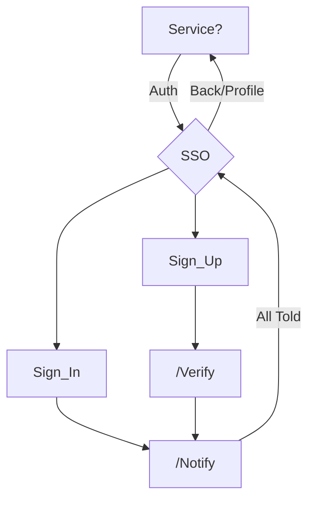

# Authentication Server

The SSO service provides an oAuth2 enabled single sign-on point for all of the OpenTHC services.
Account Creation and Authentication methods are managed through this service.

Business or Government implementers deploy and extend this SSO to integrate with their own environment through Middlware or custom Controllers.

## Installation

1. Clone this Repo onto your system `git clone ... /opt/openthc/sso`
1. Copy the example configurations in `./etc` to configure Apache and the Service.
1. Configure the SSL then visit your site https://sso.openthc.example.com/

### Database

SSO expects to connect to a database following the OpenTHC data models as described in the API.
An example schema is provided in `etc/sql/` and could/should be executed directly in a new environment.

## Configuration

* Database
* Communications Service
* oAuth2
* U2F / FIDO

### Communications

The SSO system doesn't support sending emails or text messages directly.
An external service must be provided to respond to some simple POST messages, similar to web-hooks.
This is called "CIC", and is configured in from Environment, etc-local or etcd, an empty setting disabled this service.

### oAuth2

The oAuth2 interface requires all oAuth2 service requestors to have a Service Client ID.
These are registered in the *auth_service* table.

### API

An API exists to query Company and Contact information as well.
The API calls and data structures follow those outlined in the OpenTHC API.

## Profiles

An API exists to query Company and Contact information as well the directory of Licenses.
See the [OpenTHC API Documentation](https://api.openthc.org/) for more information.

### SMS-2FA

If you want to use SMS for two-factor authentication you will need to configure the necessary service integrations CIC.

### U2F

The service is enabled for use with U2F such as RSA Secure ID and Solokeys.

* https://webauthn.me/introduction

## Flow Diagram

